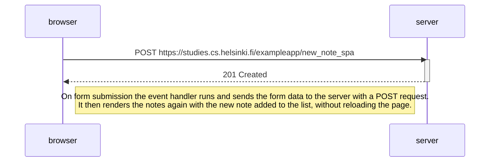

```mermaid
sequenceDiagram
    participant browser
    participant server
    
    browser->>server: POST https://studies.cs.helsinki.fi/exampleapp/new_note_spa
    activate server
    server-->>browser: 201 Created
    deactivate server
    
    note right of browser: On form submission the event handler runs and sends the form data to the server with a POST request.<br> It then renders the notes again with the new note added to the list, without reloading the page.
```
